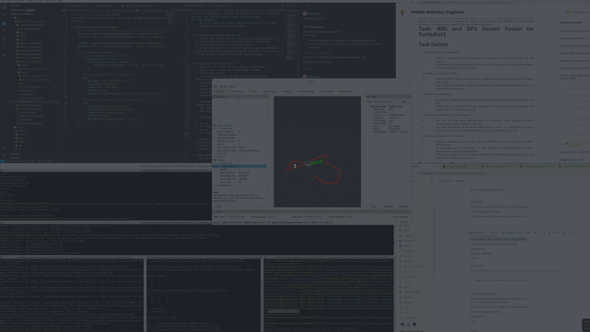
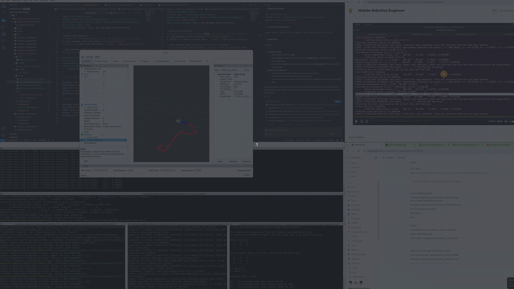

# Module 6 Assignment: IMU and GPS Sensor Fusion for TurtleBot3

## Task: IMU and GPS Sensor Fusion for TurtleBot3

### Task Details

1. **Set Up the Sensor Fusion Node:**
   - Utilize the provided EKF implementation to fuse data from TurtleBot3's IMU and GPS sensors.
   - Ensure that the EKF node processes the sensor data and outputs an accurate estimation of the robot's position and orientation.\

   1. Lets moove at our project workspace 
      *** cd /assignment_ws/src/robotics_software_engineer ***

      Initialize a source 
      *** source install/setup.bash ***

      Compile package of our lesson 
      *** colcon build --packages-select module_6_assignment ***
   
   2. To make possible to use EKF implementation we need to install Localization package sudo apt 
      *** install ros-humble-robot-localization ***

   3. Create config folder and yaml file for our EKF implementation sensor fusion 
      *** config/ekf_tb3_imu_odom.yaml ***

   4. Create launch folder and launch file to bring our EKF node with config works 
      *** launch/ekf_imu_odom.launch.py ***

   5. Add launch config DIRECTORY at CMakeLists.txt

   5. To run a fuse sensor program we need to build, open turtle3bot and than launch our EKF node
      *** colcon build --packages-select module_6_assignment ***
      *** ros2 launch turtlebot3_gazebo empty_world.launch.py ***
      *** ros2 launch module_6_assignment ekf_imu_odom.launch.py ***

   6. Ensure that EKF node processes sensor data and outputs estimation running Rqt Graph 
      *** ros2 run rqt_graph rqt_graph ***
      Select /ekf_filter_node. We see that node receive /imu, /odom and returns /odometry/filtered 
      With *** ros2 topic echo /odometry/filtered *** we can observe sensor flow at real time 

2. **Create a Custom Launch File:**
   1. Create new launch file *** ekf_tb3_imu_odom.launch.py *** 
   2. Launch file contains turtlebot3 and ekf_node from localization package + config yaml there 
   3. Build, Run and ensure that its worked properly: Gazeboo wirh turtlebot and emptyworld starts, with *** ros2 topic list *** we can see /odometry/filtered topic running 

3. **Visualize the Fused Data:**
   1. Lets run *** rviz2 *** to visualize fused data 
      After rviz2 starts, put fixed frame to ODOM 
      Than check out TF 
   2. For display raw IMU and GPS data lets create new SensorDisplayNode (sensor_display.cpp) that 
      subscribes to /odom topic and publish a red LINE_STRIP marker
      subscribes to /imu topic and publish as a blue Arrow marker
      subscribes to /odometry/filtered that outputs ekf localization node and publish a Green arrow of FUSED SENSOR

   3. Add dependency rlcpp, nav_msgs, sensor_msgs, visualization_msgs, geometry_msgs
      Add executable and dependencies 
      Add install targets sensor_display_node 
   
   4. Add sensor_display_node at launch file 

   5. To run
      *** ros2 launch module_6_assignment ekf_tb3_imu_odom.launch.py ***
      *** rviz2 ***, fixed frame odom, addd marker by topic 

   6. We can see a blue arrow that is IMU current vector, red trace that is odom history and green arrow that is fused IMU and GPS. 

         ## Visualized Fused Data

         Below is a visualization of the fused sensor data:

         

4. **Experiment with Different Q and R Values:**

   1. Lets create ekf_experiment_node to test EKF with three diferent sets 

   2. change cmakelists 

   3. Create launch file to run a node with gazeboo simulation

   4. RUN *** ros2 launch module_6_assignment ekf_experiment_low_noise.launch.py  *** with parameters of Q and R that you can change *** parameters=[{'use_sim_time': True, 'process_noise': 0.1, 'measurement_noise': 0.1}] *** 

   5. Run rVIZ and add a marker /visualization_marker 

      

5. **Analyze and Document the Results:** 

      • In the ekf_experiment_node you run three experiments using low, medium, and high noise settings.  
       – For each experiment, the EKF is reinitialized with different process (Q) and measurement (R) noise covariances by calling the helper setMatrices() before prediction and update steps.  
      • You then log the estimated state for each experiment.

      Benefits & Observations:  
       – With lower noise values, the filter is more sensitive to incoming measurements, which can result in faster convergence but may also pick up more noise.  
       – With medium noise values, there typically is a balanced tradeoff between responsiveness and stability.  
       – With higher noise values, the filter relies more on the model prediction than on the measurements, leading to smoother estimates with potentially delayed response.

      By documenting the estimated states and any observed delay or instability, you can decide which Q and R settings produce the most accurate and stable state estimation for your application.

      Robot Behavior with Different Q and R Values

      1. **Low Noise (Q = 0.1 * I, R = 0.1 * I):**
         - **Behavior:** The EKF is highly responsive to incoming measurements. This means the filter quickly adjusts the state estimate based on the sensor data.
         - **Observations:** You may notice that the estimated path (green arrow in RViz) closely follows the raw GPS data (red sphere). However, this can also result in the filter picking up more noise from the measurements, leading to a less smooth path.
         - **Use Case:** This setting is useful when you need the filter to react quickly to changes in the environment, but it may not be ideal if the sensor data is noisy.
      2. **Medium Noise (Q = 0.01 * I, R = 0.05 * I):**
         - **Behavior:** The EKF provides a balanced tradeoff between responsiveness and stability. The filter smooths out some of the noise while still reacting reasonably quickly to changes in the sensor data.
         - **Observations:** The estimated path is smoother than with low noise settings, and it still follows the general trend of the raw GPS data. This setting often provides a good balance for many applications.
         - **Use Case:** This setting is useful for general-purpose applications where you need a balance between accuracy and stability.
      3. **High Noise (Q = 0.5 * I, R = 0.5 * I):**
         - **Behavior:** The EKF relies more on the model prediction than on the measurements. This results in a very smooth and stable path but may delay corrections from actual sensor readings.
         - **Observations:** The estimated path is much smoother and less responsive to sudden changes in the sensor data. The filter may lag behind the actual position of the robot, especially if there are rapid changes in the environment.
         - **Use Case:** This setting is useful when you need a very stable estimate and can tolerate some delay in the filter's response to changes in the environment.

