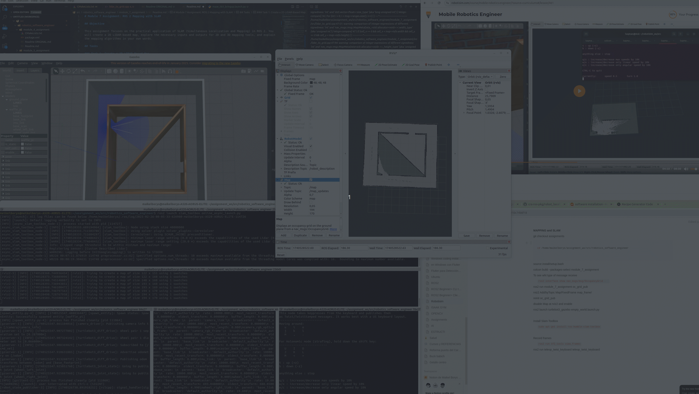
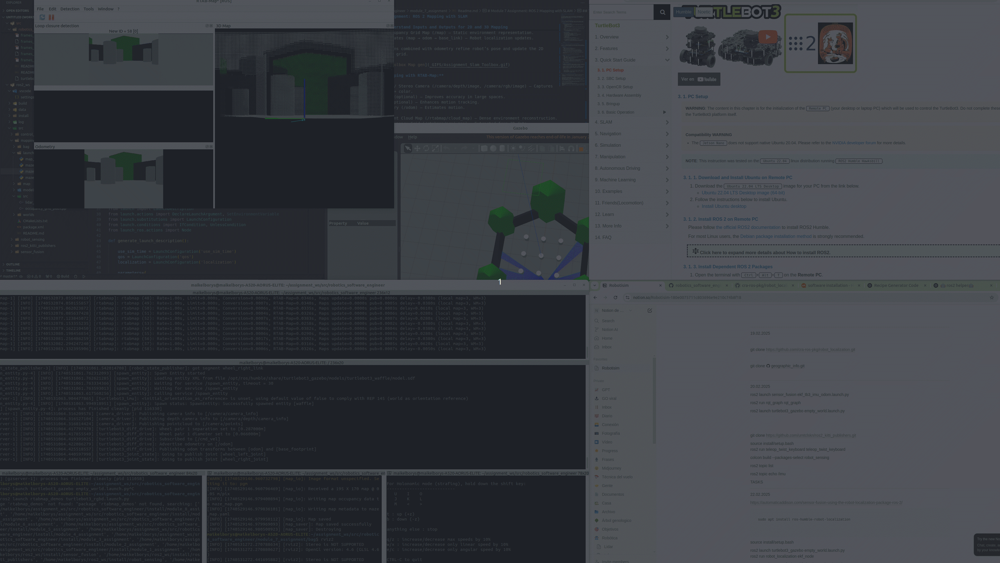

# Module 7 Assignment: ROS 2 Mapping with SLAM

### Task 1: Create a 2D LIDAR-Based Map

Set Up the Maze Environment:**
         Lets create Maze map manually:
            Open Gazebo empty world ros2 launch turtlebot3_gazebo empty_world.launch.py
            Edit/Building Editor (Ctrl+B)
            Draw a walls, put texture
            File exit/save as/module_7_assignment project/Create models folder/save @maze@

        We need to create launch file to bring our map at world with rviz, than build
            colcon build --packages-select module_7_assignment
         Try if its working properly:
            ros2 launch module_7_assignment maze_tb3_bringup.launch.py 

    2. **Perform 2D Mapping:**
         Install slam toolbox 
            sudo apt-get install ros-humble-slam-toolbox
         Launch turtle3 bot with our maze 
            ros2 launch module_7_assignment maze_tb3_bringup.launch.py 
         Launch slam_toolbox at new terminal
            ros2 launch slam_toolbox online_async_launch.py
         To vizualize at RVIZ
            Fixed Frame - map
            Add By topic/Map
         Move the robot till we have a complete map
            ros2 run teleop_twist_keyboard teleop_twist_keyboard

         Save a map generated, at a new terminal run 
            ~/assignment_ws/src/robotics_software_engineer/module_7_assignment/map_gens$ ros2 run nav2_map_server map_saver_cli -f maze_map

         Load map 
            ros2 launch module_7_assignment map_loading_2d.launch.py 

    3. **Document the Process:**
         Up 

### Task 2: Understand Inputs and Outputs for 2D and 3D Mapping

    1. **2D Mapping with SLAM Toolbox:**
      Inputs:
         LIDAR scans (/scan) – Provides range data.
         Odometry (/odom) – Tracks movement.
         TF transforms – Defines robot’s pose and frame relationships.
      Outputs:
         2D Occupancy Grid Map (/map) – Static environment representation.
         TF Updates (map → odom → base_link) – Robot localization updates.

      LIDAR scans combined with odometry refine robot’s pose and update the 2D occupancy grid.

    2. **3D Mapping with RTAB-Map:**
      Inputs:
         RGB-D / Stereo Camera (/camera/depth/image, /camera/rgb/image) – Captures depth + color.
         LIDAR (optional) – Improves accuracy in large spaces.
         IMU (optional) – Enhances motion tracking.
         Odometry (/odom) – Estimates motion.
      Outputs:
         3D Point Cloud Map (/rtabmap/cloud_map) – Dense environment reconstruction.
         2D Occupancy Grid (/rtabmap/proj_map) – Extracted from 3D data.
         TF Frames (map → odom → base_link) – Tracks robot’s pose.

      RGB-D or stereo images fused with odometry build a 3D point cloud. Loop closure refines maps.

    3. **Compare 2D and 3D Mapping:**
      2D Mapping (SLAM Toolbox) uses LIDAR and odometry to create a flat map of the environment. It works well for robots moving on a flat surface, like indoors. It's fast and efficient but doesn’t capture height differences.

      3D Mapping (RTAB-Map) uses cameras (RGB-D, stereo) or LIDAR to build a full 3D model of the space. It captures walls, objects, and elevation changes, making it more useful for complex environments. However, it needs more computing power and storage.

      Which one to choose?

         If your robot moves on the floor and just needs to navigate rooms, 2D mapping is enough.
         If your robot needs to recognize objects, handle stairs, or move in a multi-level space, 3D mapping is better.

 
         
### Task 3: Explain the Mapping Algorithm (Gmapping)

   Gmapping is a 2D SLAM algorithm that helps a robot build a map while figuring out where it is. It uses LIDAR and odometry to update its position and surroundings.

   Particle Filters: The robot guesses its location using many possibilities and picks the best fit based on laser scans.
   Map Updating: The robot gradually fills in the map as it moves.
   Handling Sensor Noise: It filters out errors from LIDAR to keep the map accurate.
   When running Gmapping, the robot scans, updates its position, and creates a reliable 2D map for navigation. 🚀

   In Task 1, we was used LIDAR and odometry to create a 2D map. Gmapping processes this data to estimate the robot’s position and refine the map.

   LIDAR scans detect walls and objects.
   Odometry provides movement data (but has small errors
   Gmapping corrects these errors by comparing past and new scans, updating the map step by step.
   This ensures the map is accurate, letting the robot navigate correctly in known spaces. 🚀

